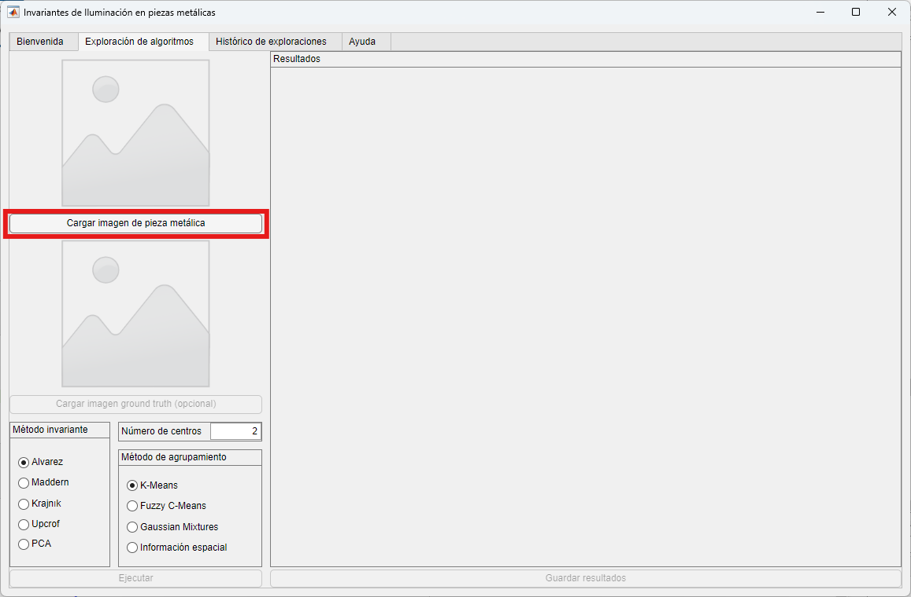
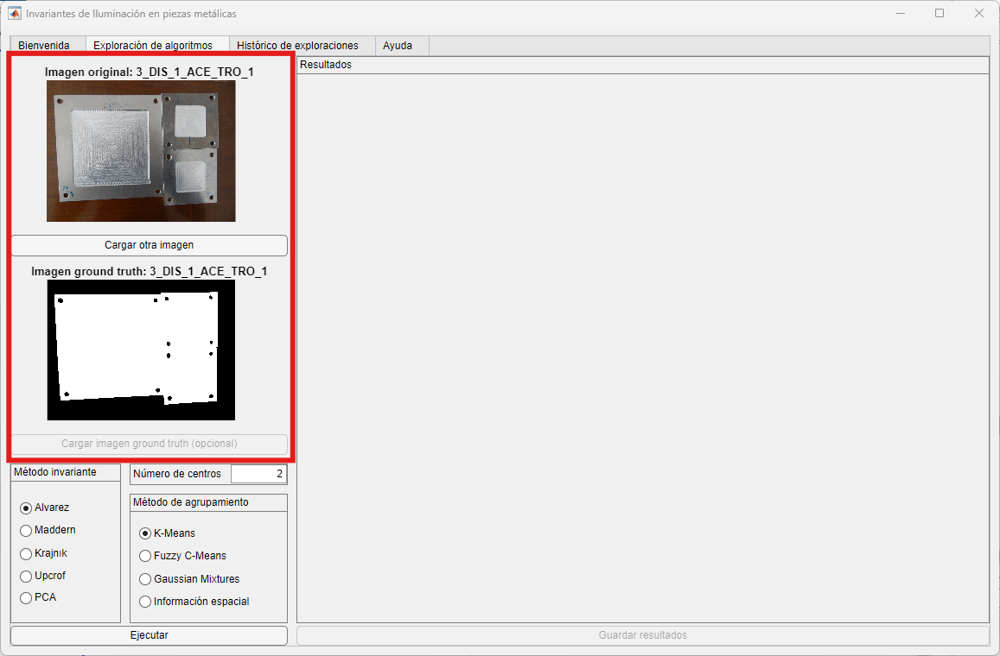
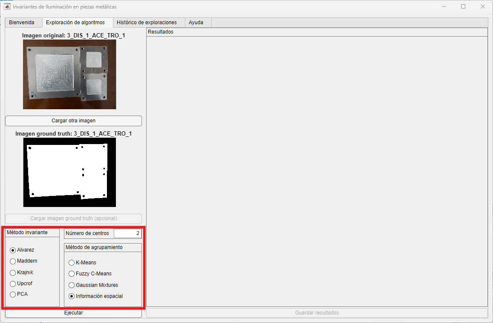
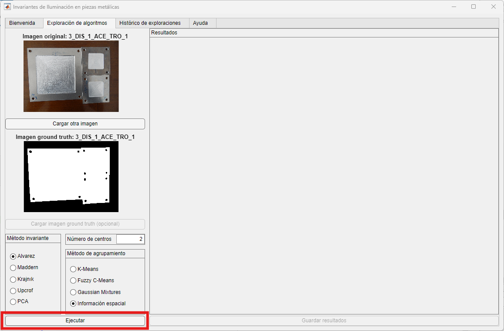
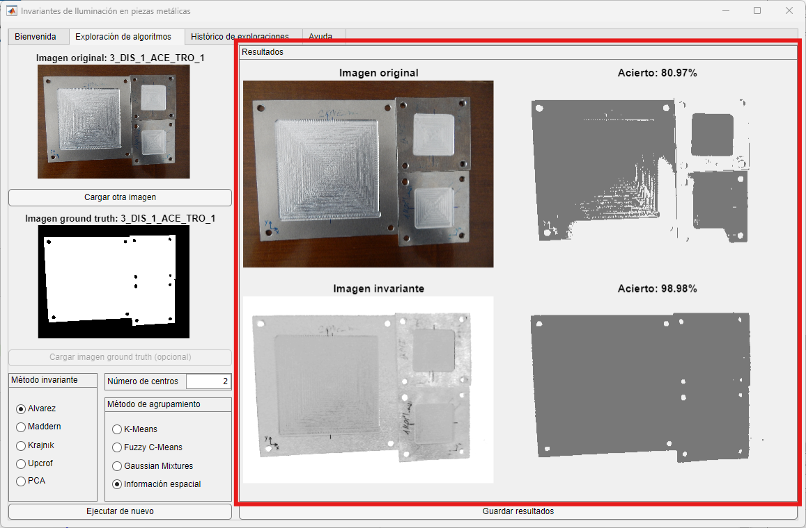
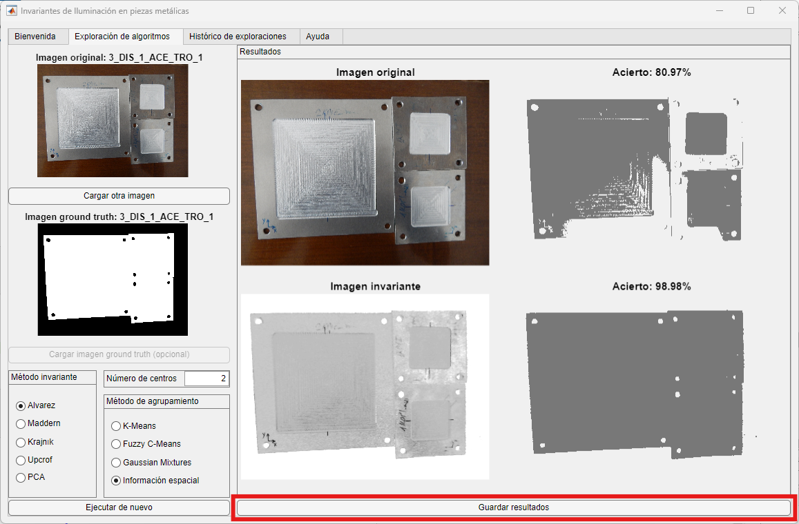

# TFG: Aplicación de transformaciones invariantes a la iluminación para mejora de la segmentación en imágenes. Aplicación a piezas metálicas

## Participantes

- Autor: Jonás Martínez Sanllorente
- Tutor: Carlos López Nozal
- Co-tutor: Pedro Latorre Carmona

## Descripción

La calidad del resultado de aplicar un método de segmentación de imágenes depende, en ocasiones, de las condiciones de iluminación de la escena. La presencia de reflexiones especulares o sombras provoca que los métodos de segmentación las identifiquen como parte de los objetos, produciendo resultados erróneos. El objetivo es la aplicación de un conjunto de métodos de pre-procesado que permiten transformar las imágenes originales en otras en las que las reflexiones, sombras, etc., están "mitigadas", lo que permite, a priori, mejorar la calidad de la segmentación.

InvIPM está diseñada para aplicar distintos métodos de transformación invariante sobre imágenes que contengan piezas metálicas para demostrar una mejora en la posterior identificación de las piezas mediante métodos de agrupamiento de imágenes.
- Podrá seleccionar tanto imágenes de ejemplo como propias.
- Diversos métodos de transformación invariante.
- Distintos métodos de agrupamiento de imágenes.
- Guardar los correspondientes resultados.


# Guía de Instalación

## 1. Prerrequisitos para la Instalación

Tener instalado MATLAB Runtime (R2023b).

### Verificar la Instalación de MATLAB Runtime

1. Abra MATLAB.
2. Escriba el siguiente comando:

    ```matlab
    >> mcrinstaller
    ```

Si no está instalado, puede descargarlo desde el siguiente enlace: [Descargar MATLAB Runtime R2023b](https://www.mathworks.com/products/compiler/mcr/index.html)

## 2. Archivos Necesarios

- **InvIPM.exe**: El archivo ejecutable principal.
- **Este archivo README**: Para guiar a los usuarios tanto en la instalación como en el funcionamiento básico de la aplicación.

## Funcionamiento de la aplicación

1. **Selección de Imagen**
    - Se solicita al usuario que elija una imagen: puede ser una imagen proporcionada por el programa o una propia.
    - Si se elige una imagen del programa, se realizarán cálculos adicionales utilizando la imagen "ground truth" almacenada.
    - Tras cargar la imagen, el programa mostrará la imagen seleccionada y, si aplica, su "ground truth" correspondiente.



2. **Selección del Algoritmo de Transformación**
    - Se presentan opciones para seleccionar el algoritmo de transformación invariante deseado.
    - Hay cuatro métodos de segmentación disponibles, donde se debe seleccionar el número de centros a utilizar (mínimo y predeterminado: dos).


3. **Ejecución de la Transformación y Segmentación**
    - Al presionar el botón "Ejecutar", se aplica la transformación invariante a la imagen seleccionada.
    - Se ejecuta el método de segmentación sobre la imagen invariante resultante y sobre la original para comparar los resultados.


4. **Resultados**
    - Los resultados se muestran en la parte derecha.
    - Si se ha utilizado una imagen proporcionada por el programa, el nombre de dicha imagen mostrará el porcentaje de acierto al compararla con su "ground truth" correspondiente.


5. **Guardar Resultados**
    - Al hacer clic en "Guardar resultados", se pueden guardar las cuatro imágenes en el dispositivo: la original y las tres resultantes de la ejecución.


6. **Nueva Ejecución**
    - Para realizar una nueva ejecución, simplemente se debe elegir una nueva imagen o modificar los parámetros de la imagen utilizada en la última ejecución.
